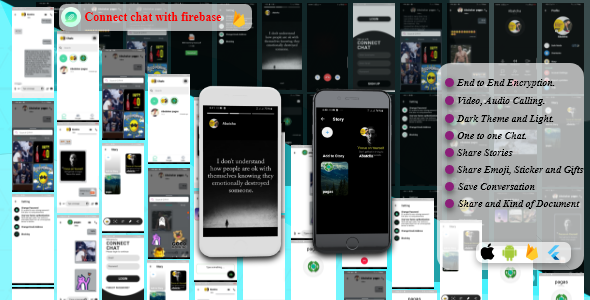
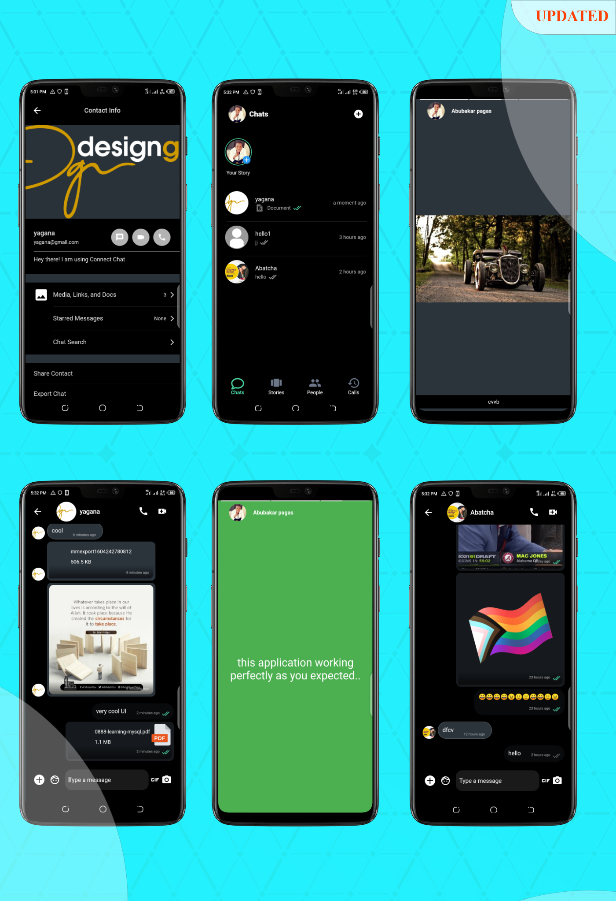
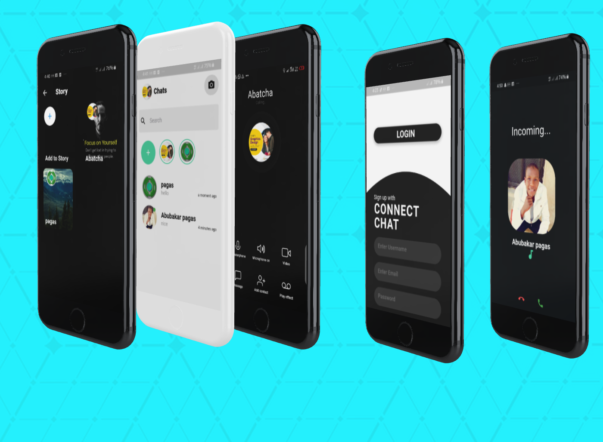
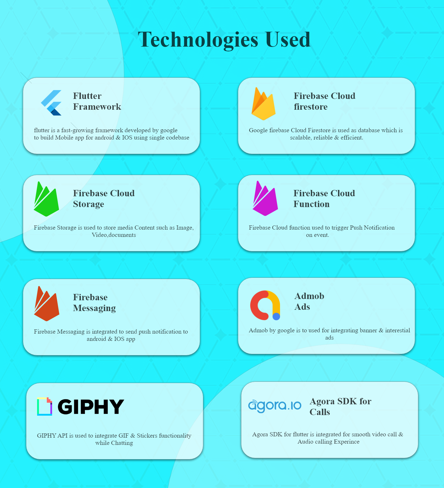
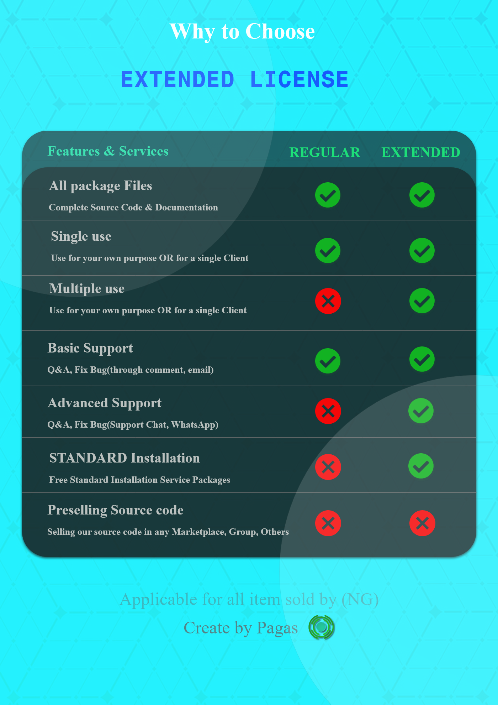

# connect_chat

<strong>Overview</strong> 

    This is clean code, more readable and beautiful, the same functionality of whatsapp,
    messenger This Appli,cation tested and trusted on Android, IOS and Web also this code is written on Flutter is a
    fully native code.

<h2>
    1st Version
</h2>
<ol>
    <li>Supported Android, IOS device and Web.</li>
    <li>Clean UI/UX.</li>
    <li>SignIn and SignUp (google and Facebook).</li>
    <li>Dark Theme and Light Supported.</li>
    <li>One to one Chat.</li>
    <li>User Status (Online, Ofline).</li>
    <li>Video Calling.</li>
    <li>Audio Calling.</li>
    <li>Call Logs.</li>
    <li>Share and Kind of Document(Video and Image).</li>
    <li>Share text message.</li>
    <li>Unread count message.</li>
    <li>Messaging seen unseen.</li>
    <li>Replaying messaging.</li>
    <li>Share Emoji, Sticker and Gifts.</li>
    <li>Share Video.</li>
    <li>Share Stories (Post Stories).</li>
    <li>Change Email.</li>
    <li>Change Password.</li>
    <li>Download any kind of Document.</li>
    <li>Save Conversation (Delete Conversation).</li>
    <li>End to End Encryption(only Sender and Reciever).</li>
    <li>Profile Update (Change Avatar, Status and Display Name).</li>
    <li>E.T.C</li>
</ol>
<h2>
    Updated version - 0.1.2
</h2>
<pre>
    -Fix bugs.
    -Imporve the performance.
    -Update Stoires Post.
    -Seen Unseen.
    -Audio Sharing.
    -Share Video.
    -Replaying messaging.
    -Unread count message.
</pre>
<h2>
    Next Updating version -0.1.3 Septempber 20th
</h2>
<pre>
    -Fix bugs.
    -Imporve the performance.
    -Refactoring.
    -Update Stoires Post.
    -Facebook Update.
    -ChatScreen Update.
</pre>

Thanks you?

