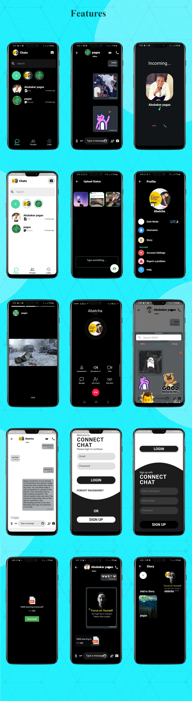

# connect_chat

<strong>Overview</strong> 

    This is clean code, more readable and beautiful, the same functionality of whatsapp,
    messenger This Appli,cation tested and trusted on Android, IOS and Web also this code is written on Flutter is a
    fully native code.

<h2>
    1st Version
</h2>
<ol>
    <li>Supported Android, IOS device and Web.</li>
    <li>Clean UI/UX.</li>
    <li>SignIn and SignUp (google and Facebook).</li>
    <li>Dark Theme and Light Supported.</li>
    <li>One to one Chat.</li>
    <li>User Status (Online, Ofline).</li>
    <li>Video Calling.</li>
    <li>Audio Calling.</li>
    <li>Call Logs.</li>
    <li>Share and Kind of Document(Video and Image).</li>
    <li>Share text message.</li>
    <li>Share Emoji, Sticker and Gifts.</li>
    <li>Share Stories (Post Stories).</li>
    <li>Change Email.</li>
    <li>Change Password.</li>
    <li>Download any kind of Document.</li>
    <li>Save Conversation (Delete Conversation).</li>
    <li>End to End Encryption(only Sender and Reciever).</li>
    <li>Profile Update (Change Avatar, Status and Display Name).</li>
    <li>E.T.C</li>
</ol>
<h2>
    Next Update Version Date
</h2>

<pre>
    -Fix bug.
    -Imporve the performance.
    -Update Stoires Post.
    -update Facebook.
    -Location Sharing.
    -Audio Sharing.
</pre>
<h2>
    <strong>IMPORTANT: </strong>
    Get Started with Social chat in ionic 5
</h2>

